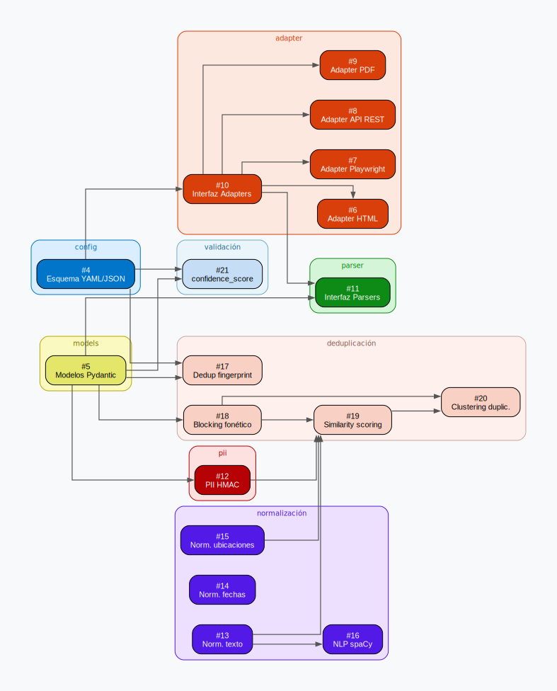

# VZLA_DEDUP
Limpiemos los registros en esta crisis.

Tras los terremotos del 24 de junio, miles de familias buscan a sus seres queridos en decenas de páginas distintas: grupos de WhatsApp, publicaciones de hospitales, redes sociales. La misma persona aparece en cuatro lugares con cuatro nombres distintos. Nadie sabe cuál es la información correcta ni cuál está desactualizada.

Este proyecto recolecta esos registros dispersos, los unifica en una sola base de datos limpia, deduplicada y consultable, y los expone via API para que cualquier dev pueda construir encima.

→ [Documentación](https://docs.google.com/document/d/1RzTa_bjouoZrjoS-fo1ojqUxjaTYy_w5Fg6Ad3fX8TU/edit?usp=sharing) · [Contribuir](./CONTRIBUTING.md) · [Reportar un problema](../../issues)

---

## El problema

Miles de personas suben datos relevantes a distintas páginas, pero están todos descentralizados. Esto genera duplicados, datos obsoletos y registros sin verificar. Cualquier dev que quiera construir algo útil hoy no tiene una fuente limpia de donde partir.

El reto es de criterio:

- ¿Cómo sabemos que dos registros son la misma persona?
- ¿Cómo descartamos datos sin cometer un error que cueste una vida?
- ¿Cómo verificamos que lo que dice una página corresponde con la realidad?

Este proyecto ataca esas preguntas en 6 etapas:

1. **Recolección**: scrapers contra páginas, APIs y archivos manuales
2. **Serialización**: estandarizar texto, imágenes y formatos distintos
3. **Protección**: hashear cédulas y datos sensibles antes de almacenar
4. **Deduplicación**: detectar y colapsar registros duplicados
5. **Almacenamiento**: base de datos cifrada con trazabilidad completa
6. **Verificación**: corroborar claims contra fuentes externas y realidad física

---

## Equipos

| Equipo | Responsabilidad |
|---|---|
| **Scrapers/Cleaners** | Recolectar, normalizar, sanear y deduplicar datos |
| **DB/API** | Base de datos, cifrado, endpoints para devs externos |
| **Verification** | Contactar fuentes externas, validar claims en vivo |

¿Quieres unirte? Escribe en el canal de Telegram o abre un Issue.

---

## Arquitectura del pipeline

El siguiente diagrama muestra el flujo completo de datos: desde las fuentes originales hasta la base de datos, pasando por adapters, parsers, modelos tipados y los módulos de limpieza compartida.


> Fuente editable: [`docs/issues/pipeline.dot`](./docs/issues/pipeline.dot) (Graphviz)

---

## Pipeline en detalle

El pipeline tiene cuatro capas secuenciales. Las dos primeras forman la **recolección**; las dos últimas son la **limpieza**, completamente independiente y reutilizable cuando el sistema pase a recibir datos de fuentes externas en vez de scrapearlos.

### Adapters

Cada tipo de fuente tiene un adapter dedicado que se encarga exclusivamente del fetch. El output de todos es siempre el mismo: el contenido raw de la fuente, sin procesar.

| Fuente | Adapter |
|--------|---------|
| WebApps con JS dinámico | Playwright |
| HTML estático | BeautifulSoup |
| APIs / JSON | httpx |
| PDFs y archivos manuales | pdfplumber |

### Parsers

Cada fuente tiene un parser específico que implementa una interfaz común. El parser recibe el raw del adapter y produce una entidad tipada: `Person`, `AcopioCenter` o `Event`. El parser conoce la estructura de su fuente: qué campo es el nombre, qué campo es la cédula, qué status mapea a qué enum.

La configuración de fuentes (URL, tipo, parser asignado, trust_tier) vive en un YAML. **Agregar una fuente nueva requiere únicamente escribir un parser nuevo. El resto del pipeline no cambia.**

### Limpieza

La limpieza opera sobre entidades tipadas, no sobre texto crudo. Los módulos corren en **orden fijo** con una justificación concreta para cada posición:

1. **PII** — va primero porque nunca se debe operar sobre datos sensibles en crudo más tiempo del necesario. Las cédulas y teléfonos se reemplazan por su HMAC antes de cualquier otro procesamiento. Los campos originales no se guardan.

2. **Normalización** — va antes de deduplicación porque el matching necesita texto uniforme: `"JOSE LUIS"` y `"José Luis"` deben ser el mismo registro antes de comparar, no después. Cubre: unicode, tildes, mayúsculas, abreviaciones, fechas → ISO 8601, ubicaciones → normalización de nombre + llamada opcional a OpenStreetMap (si la API falla, el campo de coordenadas queda `null`; el registro no se descarta). Para fuentes de texto libre (PDFs, HTML narrativo) incluye un paso de NLP con spaCy (`es_core_news_sm`) para extraer entidades antes del mapeo.

3. **Deduplicación** — para eventos y centros de acopio usa un fingerprint por contenido (SHA-256 tras normalización). Para personas el problema es más difícil porque el mismo individuo puede aparecer con nombre incompleto, sin cédula o con edad aproximada:
   - **Blocking**: agrupa por fonética (Double Metaphone o NYSIIS — no Soundex, que fue diseñado para inglés) + primeras letras + estado. Solo se comparan candidatos dentro del mismo bloque.
   - **Similarity scoring**: Jaro-Winkler para nombres, coincidencia de cédula HMAC, rango de edad, estado/ciudad, y opcionalmente similitud facial.
   - **Clustering**: pares que superan el umbral se marcan como `probable_duplicate`. El algoritmo propone; un voluntario confirma.

4. **Validación** — corre al final, sobre datos ya limpios y deduplicados. Asigna un `confidence_score` basado en cuántos campos clave están presentes y en el `trust_tier` de la fuente. Los campos ausentes se exportan como `null`. No se omiten.

### Export

La salida son tres streams JSONL independientes, listos para ingestión por DB/API:

```
persons.jsonl       →  registros de personas
acopio.jsonl        →  centros de acopio activos
events.jsonl        →  eventos (sismos, zonas afectadas)
```

---

## Schema de datos

Todas las fechas en **UTC estricto** (ISO 8601 con `Z`). Nulos siempre como `null` explícito, nunca `""` ni `"N/A"`. IDs como UUID v4. Los valores de campos categóricos son strings controlados — los enums completos están en [`docs/schema.md`](./docs/schema.md).

### `events.jsonl`

```json
{
  "event_id": "f0e1d2c3-b4a5-6789-0fed-cba987654321",
  "name": "Terremoto Yaracuy 24-06-2026",
  "event_type": "earthquake",
  "occurred_at": "2026-06-24T14:32:00Z",
  "affected_states": ["Yaracuy", "Lara", "Portuguesa"],
  "magnitude": 7.30,
  "depth_km": 12.50,
  "status": "active",
  "external_ids": {
    "usgs": "us7000n4xy",
    "funvisis": "VEN-2026-001"
  }
}
```

### `persons.jsonl`

```json
{
  "person_record_id": "a1b2c3d4-e5f6-7890-abcd-ef1234567890",
  "event_id": "f0e1d2c3-b4a5-6789-0fed-cba987654321",
  "full_name": "JOSE LUIS PEREZ MARIN",
  "alternate_names": ["JOSE PEREZ", "JOSELO PEREZ MARIN"],
  "cedula_hmac": "3b4c9e2a1fd82f6a0bc347e1a9f2c8d5e047b3a12f9c6d71e8b405a3c2d1f9e0",
  "cedula_masked": "V-****5821",
  "age_range": {"min": 30, "max": 40},
  "sex": "M",
  "is_minor": false,
  "last_known_location": {
    "raw": "El Tocuyo, Lara",
    "estado": "Lara",
    "municipio": "Morán",
    "parroquia": null,
    "lat": 9.7834,
    "lng": -69.7921
  },
  "status": "missing",
  "verification_status": "unverified",
  "confidence_score": 0.420,
  "source_url": "https://encuentralos.org/registro/12345"
}
```

Las notas adicionales por persona (perdido, herido, encontrado, fallecido) van en `person_notes.jsonl` referenciando el mismo `person_record_id`. Ejemplos completos en [`docs/schema.md`](./docs/schema.md).

### `acopio.jsonl`

```json
{
  "acopio_id": "h8c9d0e1-f2a3-4567-bcde-678901234567",
  "event_id": "f0e1d2c3-b4a5-6789-0fed-cba987654321",
  "name": "Centro de Acopio Polideportivo Municipal San Felipe",
  "location": {
    "raw": "Polideportivo Municipal, San Felipe, Yaracuy",
    "estado": "Yaracuy",
    "municipio": "San Felipe",
    "parroquia": null,
    "lat": 10.3401,
    "lng": -68.7456
  },
  "confidence_score": 0.850,
  "status": "active",
  "needs": ["agua", "alimentos", "medicamentos", "colchonetas", "pañales"],
  "last_verified_at": "2026-06-26T08:00:00Z",
  "managing_org": "Cruz Roja Venezuela — Seccional Yaracuy",
  "contact_hmac": "9f1c3e7a2b4d6f8e0a2c4e6f8b0d2f4a6c8e0b2d4f6a8c0e2f4b6d8a0c2e4f6",
  "contact_masked": "+58 412 ***7834",
  "capacity": 400,
  "current_load": 283
}
```

El campo `needs` acepta únicamente keywords normalizadas: `agua` · `alimentos` · `medicamentos` · `colchonetas` · `ropa` · `calzado` · `higiene` · `pañales` · `leche_formula` · `generador` · `combustible` · `herramientas` · `voluntarios` · `transporte` · `otro`. El parser es responsable de mapear texto libre al keyword antes de exportar.

---

## Mapa de dependencias

El siguiente diagrama muestra las dependencias entre los issues activos del proyecto. Úsalo como referencia para entender qué bloquea qué antes de empezar a trabajar.



> Fuente editable: [`docs/issues/issues_graph.dot`](./docs/issues/issues_graph.dot) (GraphViz)

---

## Estado actual

El pipeline de scrapers está operativo con datos. La API y la capa de almacenamiento están en construcción.

```
api/                        → FastAPI (en construcción)
│   ├── auth.py
│   ├── main.py
│   └── routes/
scrapers/                   → Pipeline principal
│   ├── cli.py              → Punto de entrada CLI
│   ├── config/             → Fuentes de datos configurables
│   ├── pipelines/          → Orquestador
│   ├── fetchers/           → HTTP + archivos locales
│   ├── extractors/         → HTML, JSON, RSS, texto
│   ├── sanitizers/         → Detección y redacción de PII
│   ├── dedup/              → Deduplicación por fingerprint
│   ├── outputs/            → Exportación JSONL
│   └── tests/
shared/                     → Config, hashing y storage compartido
verification/               → (próximamente)
```

---

## Quickstart

```bash
git clone https://github.com/DataVenezuela/VZLA_DEDUP.git
cd VZLA_DEDUP
python3 -m venv .venv
source .venv/bin/activate
pip install -r scrapers/requirements.txt

# Correr demo offline con datos locales
python -m scrapers.cli run --config scrapers/config/sources.demo.yaml

# Correr tests
pytest scrapers/tests
```

---

## Stack

**Scrapers/Cleaners**
- Python: `BeautifulSoup`, `Playwright`, `httpx`, `pdfplumber`, `PyYAML`
- Detección y redacción de PII con regex + HMAC para correlación de cédulas
- NLP: `spaCy` (`es_core_news_sm`) para extracción de entidades en texto libre

**DB/API**
- PostgreSQL
- FastAPI (Python)
- SQLAlchemy

**Deduplicación**
- Fingerprint SHA-256 por contenido normalizado (eventos y centros de acopio)
- Blocking fonético: Double Metaphone / NYSIIS (personas)
- Jaro-Winkler para similitud de nombres

---

## Contribuciones

Lee [CONTRIBUTING.md](./CONTRIBUTING.md) antes de empezar. La versión corta:

1. Crea una rama desde main: `git checkout -b scrapers/lo-que-vas-a-hacer`
2. Haz tus cambios y corre `pytest scrapers/tests`
3. Abre un Pull Request — **requiere aprobación explícita del dueño del repo antes de mergear a main**
4. No commitees datos reales, dumps ni archivos con PII

---

## Seguridad y datos personales

Este proyecto maneja información de personas desaparecidas. Las reglas son estrictas:

- Cédulas, teléfonos y contactos se redactan o se HMAC antes de exportar, nunca en claro
- Los outputs del pipeline van a `scrapers/runtime_output/` (en `.gitignore`), nunca al repo
- Existe un mecanismo de eliminación de datos a pedido

---

MIT License · 2026 · DataVenezuela
