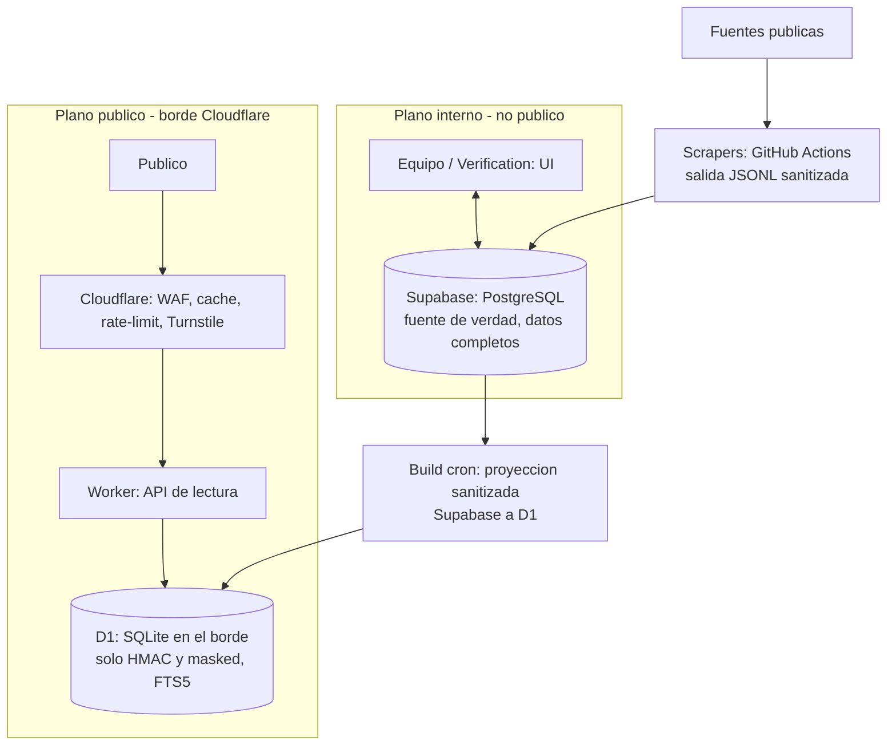

# ADR 0001 — Arquitectura del plano de serving público

| Campo | Valor |
|---|---|
| Estado | Aceptada |
| Fecha | 2026-06-27 |
| Decisores | DB/API, Scrapers/Cleaners, Infraestructura |
| Reemplaza a | — |
| Relacionado con | `docs/pipeline.md`, `docs/schema.md`, `docs/base-standards.md` |

---

## 1. Contexto

VZLA_DEDUP expondrá una **API REST pública** para que cualquier persona pueda
buscar registros de personas (desaparecidas, encontradas, fallecidas), centros
de acopio y eventos, consolidados y deduplicados por el pipeline.

El contexto es una crisis (doble terremoto del 24-06-2026). Eso impone tres
restricciones que dominan cualquier decisión técnica:

1. **Costo casi nulo.** El proyecto es humanitario, sin presupuesto de
   infraestructura sostenido. La arquitectura debe costar ~0 en reposo.
2. **Picos de tráfico extremos.** Cuando un medio o un canal comparte el enlace,
   o cuando ocurre una réplica, llega una avalancha de peticiones concentradas
   en pocos minutos y muy repetitivas (los mismos nombres y zonas que están en
   las noticias).
3. **PII como riesgo existencial.** Se trabaja con personas vulnerables. Una
   filtración de datos en claro es inaceptable. Ver `docs/base-standards.md §10`.

El README del proyecto anticipaba un stack `PostgreSQL + FastAPI + SQLAlchemy`
para DB/API, y el equipo ya opera **Supabase (PostgreSQL)**. Esta ADR no descarta
Supabase: redefine su rol.

---

## 2. Fuerzas / análisis del workload

La observación central es que el workload público tiene tres propiedades:

* **Lectura-dominante, escritura por lotes.** El público solo consulta. Los datos
  cambian por ciclos del pipeline (`refresh_minutes` de 30–60 min en las configs
  de fuentes), nunca dentro del camino de la petición.
* **Tráfico en picos y altamente repetitivo.** Se absorbe con caché en el borde,
  no escalando una base de datos transaccional.
* **El dato público es un subconjunto pequeño y sanitizado.** Solo campos seguros
  (ver §5). Cabe holgadamente en un único archivo SQLite.

De aquí se sigue que una base de datos transaccional viva (Postgres) **no es** la
herramienta adecuada para servir al público: paga cómputo 24/7, su pool de
conexiones es un cuello de botella bajo pico, y exponerla amplía la superficie de
ataque sobre los datos completos.

---

## 3. Decisión

Se adopta una arquitectura de **dos planos desacoplados** unidos por un artefacto
inmutable (patrón CQRS / read-model):

### 3.1 Plano interno (fuente de verdad) — Supabase / PostgreSQL

* Mantiene los **datos completos**, el historial y las relaciones (`docs/schema.md`).
* Es donde el equipo de **Verification** trabaja: confirmar/rechazar candidatos
  de duplicado, marcar `verification_status`, resolver conflictos.
* Aporta **visibilidad por UI** para operadores autorizados (la ventaja real de
  Supabase).
* **Nunca recibe tráfico del público.** Acceso autenticado, interno.
* Sigue gobernado por `base-standards.md §4–5` (Python, SQLAlchemy).

### 3.2 Plano público (serving) — Cloudflare Worker + D1

* Una **API de solo-lectura** servida desde el borde de Cloudflare.
* Los datos viven en **D1** (SQLite gestionado en el borde) y contienen
  **únicamente la proyección sanitizada** (§5): jamás PII en claro.
* La búsqueda usa **FTS5** + claves de bloqueo fonético precomputadas.
* El borde aporta **caché, WAF, rate-limiting y Turnstile** (anti-bot).

### 3.3 Puente — Build job (cron)

* Un job programado (GitHub Actions) proyecta la vista pública desde Supabase,
  arma el índice y lo publica a D1 con **swap atómico** (§7), cada 30–60 min.

### 3.4 Excepción explícita a `base-standards.md`

`base-standards.md §4` (solo Python) y §5 (solo SQLAlchemy) **siguen vigentes
para el plano interno y todo el pipeline**. El plano público de serving se aparta
deliberadamente: se implementa en **TypeScript sobre Cloudflare Workers**, porque
el runtime Python de Workers aún es beta y el endpoint de lectura es delgado. Esta
excepción queda acotada a `serving/` (ver §12) y no se extiende al resto del repo.

---

## 4. Diagrama



Flujo de petición: descendente (`U → CF → W → D1`).
Flujo de datos: ascendente (`SRC → SCR → SB → BUILD → D1`).
El artefacto D1 es la frontera entre el plano caliente y el frío.

---

## 5. Modelo de datos del artefacto público

El artefacto D1 contiene **solo** los campos seguros de exportación. Para
`persons`, derivados de `docs/schema.md`:

```text
person_record_id        UUID v4
event_id                UUID v4
full_name               normalizado (mayúsculas)
alternate_names         lista
cedula_hmac             HEX 64 (sin prefijo) — para lookup, nunca reversible
cedula_masked           últimos 4 dígitos
age_range               {min, max}
sex
last_known_location     estado / municipio / parroquia / lat / lng
status                  enum
verification_status     enum
confidence_score        0.000–1.000
source_url
```

**Prohibido en el artefacto público:** cédula en claro, teléfono en claro,
contacto familiar, fotos reales, datos médicos identificables, `raw_content`,
y cualquier campo marcado sensible en `base-standards.md §10`.

Tablas análogas, igualmente sanitizadas, para `acopio_centers` y `events`.

> Garantía de blast-radius: una brecha total del plano público expone, en el peor
> caso, datos **ya sanitizados**. El plano interno y los crudos quedan intactos.

---

## 6. Contrato de la API pública (v1)

Solo lectura. Sin endpoint de "listar todo". Sin paginación profunda.

```text
GET /v1/personas?nombre=<≥3 chars>&estado=<opcional>&status=<opcional>
GET /v1/personas/{person_record_id}
GET /v1/acopio?estado=<opcional>&needs=<opcional>
GET /v1/events
GET /healthz
```

Reglas del contrato:

* Resultados **acotados** (máx 20 por respuesta).
* `nombre` exige término específico (≥3 caracteres); no se permite consulta vacía.
* Búsqueda por cédula: el HMAC se computa **server-side y no se registra en logs**;
  se exige combinarla con otro campo para evitar verificación masiva de identidades
  (ver §8).
* Respuestas con `Cache-Control: public, max-age=120` para que el borde absorba el pico.
* Toda fila mantiene `source_url` (trazabilidad, `docs/README.md` regla de oro).

---

## 7. Estrategia de actualización (build & publish)

1. El build job lee la proyección pública desde Supabase.
2. Construye las tablas + índices FTS5 + claves de bloqueo en una tabla
   `*_staging` dentro de D1.
3. **Swap atómico**: dentro de una transacción, reemplaza la tabla en vivo por la
   de staging, de modo que ninguna petición observe un estado parcial.
4. Frecuencia: cada 30–60 min (alineado con `refresh_minutes` de las fuentes).

**Derecho al olvido / eliminación a pedido:** una petición de borrado entra como
`denylist` aplicada por el build; se propaga al plano público en ≤1 ciclo, sin
tocar el historial del plano interno. Cumple el mecanismo del README §"Seguridad".

---

## 8. Seguridad, PII y anti-abuso

* **PII:** el plano público físicamente no posee datos en claro (§5).
* **Anti-enumeración / anti-scraping:** sin "listar todo", resultados acotados,
  término de búsqueda obligatorio, rate-limit por IP en el borde, Turnstile ante
  patrones sospechosos.
* **Cédula:** no confirmar existencia a ciegas; HMAC sin loguear; requiere campo
  adicional. La API no debe servir como verificador masivo de identidades.
* **Logs sin PII:** se extiende `docs/pipeline.md §14` a la API. Prohibido loguear
  query strings con cédulas o nombres completos sensibles.
* **Secretos:** `PII_HMAC_SECRET` y credenciales de Supabase viven en el gestor de
  secretos de la plataforma (Cloudflare / GitHub Actions), nunca en el repo.

---

## 9. Costo estimado

| Componente | Plataforma | Costo |
|---|---|---|
| Plano público (Worker + D1 + R2 + WAF + Turnstile) | Cloudflare | $0–5 / mes |
| Plano interno (datos completos + UI) | Supabase | plan actual del equipo |
| Scrapers + build job | GitHub Actions (repo público) | $0 |
| Dominio | — | ~$10 / año |

El borde absorbe la mayoría del tráfico (hit-rate esperado >95% por la naturaleza
repetitiva de las consultas en crisis), por lo que el costo no escala con el pico.

---

## 10. Consecuencias

**Positivas**

* Costo ~0 en reposo y plano frente a picos.
* Latencia baja para usuarios en Venezuela (servido desde el borde).
* Blast-radius de PII acotado a datos ya sanitizados.
* Supabase conserva su valor (visibilidad, Verification) sin exponerse.
* El pipeline y el plano público quedan desacoplados: un fallo de scraping no
  tumba la búsqueda.

**Negativas / costos asumidos**

* El plano público se implementa en TypeScript, fuera del estándar Python del repo
  (excepción acotada, §3.4). Requiere familiaridad mínima con Workers/Wrangler.
* El rebuild de D1 exige cuidado operativo (swap atómico, §7).
* Los datos públicos son *eventualmente consistentes* (retraso de hasta un ciclo
  respecto a Supabase). Aceptable para este dominio.

**Riesgos y mitigaciones**

* *Tope de tamaño de D1* (~10 GB): el dataset es pequeño; monitorear. Si se supera,
  migrar a artefacto SQLite en R2 servido por un origen (ver Alternativa B).
* *Abuso pese al rate-limit*: endurecer reglas WAF y Turnstile; revisar métricas.

---

## 11. Alternativas consideradas

**A. PostgreSQL público (Supabase expuesto directamente).** Rechazada: costo 24/7,
pool de conexiones como cuello de botella en pico, y mayor superficie de ataque
sobre los datos completos.

**B. FastAPI + SQLite-en-memoria sobre Cloud Run/Fly, artefacto en R2.** Mantiene
el stack Python y publica el dato subiendo un archivo a R2. Viable y es el **camino
de respaldo** si el equipo necesita salir sin asumir Workers, o si D1 queda chico.
Se descartó como opción principal porque añade un origen que mantener, cold starts,
y latencia de una sola región; el contrato HTTP (§6) es idéntico, así que migrar
entre B y la opción elegida cuesta ~50 líneas.

**C. Worker + D1 (elegida).** Costo cero real, sin origen que mantener, ejecución
en el borde cerca del usuario. Costo: TypeScript y el cuidado del rebuild de D1.

---

## 12. Plan de implementación (pendientes)

```text
1. serving/                 → Worker (TypeScript) + wrangler config
   - endpoints §6 sobre D1 (FTS5)
2. tools/build_public_index → job que proyecta Supabase → D1 (swap atómico)
   - en Python (estándar del repo): lee Supabase, valida proyección §5, publica
3. .github/workflows/       → cron del build job
4. Cloudflare               → cache rules, WAF, rate-limit, Turnstile, secretos
5. docs/schema.md           → declarar la "vista pública" (campos §5) si falta
6. Tests                    → contrato API §6, garantía de no-PII en la proyección
```

Los stubs actuales `api/main.py`, `api/auth.py`, `api/routes/records.py` y
`shared/storage.py` quedan supeditados a esta decisión: o se reorientan al plano
interno (Supabase/SQLAlchemy) o al build job, no a servir tráfico público.

---

## Regla de oro (heredada de `docs/README.md`)

```text
Duplicar es tolerable.
Perder trazabilidad no.
Exponer PII no.
El plano público no posee datos en claro.
```
