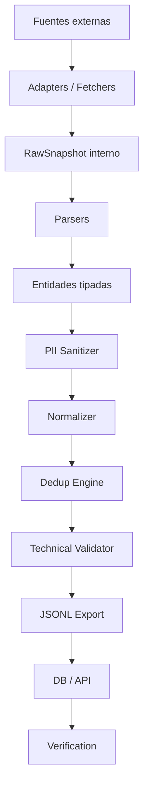

# VZLA_DEDUP — Pipeline técnico

Este documento describe el flujo técnico del pipeline de VZLA_DEDUP.

El objetivo del pipeline es recolectar registros dispersos, convertirlos en entidades tipadas, proteger datos sensibles, normalizar la información, detectar posibles duplicados y exportar archivos JSONL listos para ser ingeridos por DB/API.

El pipeline debe ser modular, trazable y seguro.

---

## Resumen del flujo

```text
Fuentes externas
    ↓
Adapters / Fetchers
    ↓
Parsers
    ↓
Entidades tipadas
    ↓
Sanitización PII
    ↓
Normalización
    ↓
Deduplicación
    ↓
Validación técnica
    ↓
Export JSONL
    ↓
DB/API
    ↓
Verification humana / externa
```

---

## Estado de implementación

El orquestador del pipeline está implementado en `scrapers/pipelines/run_pipeline.py`.

### Flujo ejecutable

```text
SourceConfig (YAML)
  → adapter (api_json / html_static / manual_file)
    → parser (encuentralos / fallback genérico)
      → PII tokenizer (HMAC o strip)
        → normalización (fechas, ubicaciones)
          → dedup (Event / AcopioCenter; Person excluido intencionalmente)
            → confidence_score
              → JSONL export (persons.jsonl / acopio.jsonl / events.jsonl)
```

### Adapters implementados

| Tipo | Módulo | Estado |
|------|--------|--------|
| `api_json` | `scrapers/adapters/api_adapter.py` | ✅ Implementado (httpx, paginación, retry) |
| `html_static` / `rss` | `scrapers/adapters/http_client.py` | ✅ Implementado (fetch wrapper) |
| `manual_file` / `text` | `scrapers/adapters/local_file.py` | ✅ Implementado (lectura local) |
| `webapp` / `pdf` | — | ⏳ Pendiente (se omite con warning) |

### Parsers implementados

| Parser | Módulo | Estado |
|--------|--------|--------|
| `encuentralos` | `scrapers/parsers/encuentralos_parser.py` | ⏳ Pendiente |
| Fallback genérico | `_TextFallbackParser` (interno) | ✅ Para text/html/rss |

### Ejecución

```bash
# Pipeline completo con fuentes del config
python -m scrapers.cli run --config scrapers/config/sources.yaml --output scrapers/runtime_output

# Limitar a N registros por fuente
python -m scrapers.cli run --config scrapers/config/sources.yaml --output scrapers/runtime_output --limit 50
```

### Diseño de resiliencia

- Un error en un registro individual no tumba el pipeline.
- Un error en una fuente entera se loguea y se continúa con la siguiente.
- `PII_SALT` es opcional en CI: sin salt, los campos PII crudos se eliminan antes de exportar.
- La deduplicación de Person se excluye intencionalmente del orquestador (requiere revisión humana).

### Tests

28 tests de integración offline en `scrapers/tests/test_run_pipeline.py`.

---

## Principios del pipeline

El pipeline sigue estos principios:

1. Cada capa tiene una responsabilidad clara.
2. La recolección no debe conocer reglas de negocio.
3. Los parsers no deben persistir PII en claro.
4. La limpieza debe operar sobre entidades tipadas.
5. La deduplicación de personas no debe ser destructiva.
6. Todo output debe mantener trazabilidad hacia la fuente.
7. Los registros incompletos no deben descartarse automáticamente.
8. Los errores de un registro no deben tumbar todo el pipeline.
9. Los campos desconocidos deben exportarse como `null`.
10. Nada de datos reales debe aparecer en tests, fixtures o documentación.

---

## Diagrama general



---

## Capas del pipeline

## 1. Fuentes externas

Las fuentes externas son los lugares desde donde se obtiene información.

Ejemplos:

* Webs públicas.
* WebApps con JavaScript.
* APIs públicas.
* PDFs públicos.
* Archivos manuales autorizados.
* Planillas públicas.
* Publicaciones verificables.
* Fuentes oficiales.
* Fuentes de organizaciones humanitarias.

No todas las fuentes deben tener el mismo nivel de confianza.

Cada fuente debe estar declarada en una configuración explícita antes de ser scrapeada.

---

## 2. Source Config

Antes de crear un scraper, la fuente debe registrarse en un archivo de configuración.

Ejemplo:

```yaml
source_key: hospital_central_demo
name: Hospital Central Demo
type: html_static
entity_type: person
url: https://example.org/demo
parser: hospital_central_person_parser
trust_tier: 1
enabled: true
rate_limit_per_minute: 10
allowed_domains:
  - example.org
notes: Fuente demo sin datos reales.
```

La configuración debe indicar:

* Qué fuente se va a consultar.
* Qué tipo de fuente es.
* Qué parser debe procesarla.
* Qué entidad produce.
* Qué nivel de confianza tiene.
* Qué dominios están permitidos.
* Qué límites de consulta deben respetarse.

La configuración detallada vive en `docs/source_config.md`.

---

## 3. Adapters / Fetchers

Los adapters son responsables únicamente de obtener contenido raw desde una fuente.

Un adapter no debe interpretar el significado del contenido.

### Tipos de adapters

```text
webapp_js    → Playwright
html_static  → BeautifulSoup / httpx
api_json     → httpx
pdf_manual   → pdfplumber
local_file   → lectura local controlada
```

### Responsabilidad del adapter

El adapter debe:

* Hacer fetch de la fuente.
* Respetar rate limits.
* Validar dominio permitido.
* Capturar status HTTP.
* Capturar content type.
* Calcular hash del contenido.
* Devolver raw content al parser.
* Registrar errores técnicos sin PII.

El adapter no debe:

* Normalizar nombres.
* Hashear cédulas.
* Deduplicar personas.
* Decidir estados de negocio.
* Hacer merges.
* Persistir datos sensibles.
* Loguear contenido raw con PII.

---

## Salida interna del adapter

La salida del adapter es un objeto interno llamado `RawSnapshot`.

Ejemplo:

```json
{
  "source_key": "hospital_central_demo",
  "source_url": "https://example.org/demo",
  "fetched_at": "2026-06-24T15:30:00Z",
  "http_status": 200,
  "content_type": "text/html",
  "content_hash": "sha256:examplehash",
  "raw_content": "<html>...</html>"
}
```

`raw_content` puede contener PII.

Por eso:

* Es solo de uso interno.
* No debe exportarse a JSONL.
* No debe commitearse.
* No debe imprimirse completo en logs.
* No debe persistirse sin una política explícita de seguridad.

---

## 4. Parsers

Los parsers convierten el contenido raw de una fuente en entidades tipadas.

Cada fuente debe tener su propio parser, porque cada fuente puede tener estructuras, nombres de campos y formatos distintos.

Ejemplos:

```text
encuentralos_parser      → Person
veneconnect_parser       → AcopioCenter
usgs_parser              → Event
hospital_central_parser  → Person
```

---

## Responsabilidad del parser

El parser debe:

* Recibir un `RawSnapshot`.
* Extraer registros individuales.
* Mapear campos de la fuente al modelo interno.
* Convertir estados externos a enums internos.
* Extraer fechas, ubicaciones, nombres y notas.
* Enviar datos sensibles al sanitizer antes del export.
* Asociar cada registro con su fuente.
* Producir entidades tipadas.

El parser no debe:

* Guardar PII en claro.
* Loguear cédulas, teléfonos o direcciones exactas.
* Hacer deduplicación global.
* Confirmar que dos personas son la misma.
* Descartar registros por estar incompletos.
* Inventar campos que la fuente no tiene.

---

## NLP y texto libre

Cuando una fuente contiene texto libre, como PDFs narrativos o HTML sin estructura clara, el parser puede usar extracción de entidades.

Ejemplos:

* Nombres de personas.
* Hospitales.
* Estados.
* Municipios.
* Fechas.
* Condición reportada.
* Centros de acopio.
* Necesidades urgentes.

Este paso pertenece al parser o a un extractor usado por el parser.

La limpieza posterior no debería trabajar sobre texto crudo, sino sobre entidades ya tipadas.

---

## Salida interna del parser

El parser debe producir entidades tipadas.

Ejemplo conceptual:

```json
{
  "entity_type": "person",
  "source_key": "hospital_central_demo",
  "source_url": "https://example.org/demo",
  "raw_external_id": "row-15",
  "full_name_raw": "José Luis Pérez",
  "cedula_raw": "V-12345678",
  "phone_raw": null,
  "age_raw": "aprox. 35",
  "status_raw": "No localizado",
  "location_raw": "El Tocuyo, Lara",
  "source_date_raw": "24/06/2026 14:30"
}
```

Este objeto es interno.

Antes de exportar, debe pasar por sanitización PII y normalización.

---

## 5. Entidades tipadas

Después del parser, el sistema debe trabajar con entidades tipadas.

Entidades principales:

```text
Event
Person
PersonNote
PersonSource
PersonPhoto
AcopioCenter
DedupCandidate
```

La idea es que el resto del pipeline no dependa de la estructura original de la fuente.

Una vez que existe una entidad tipada, los módulos de limpieza, normalización, deduplicación y export pueden ser reutilizados para muchas fuentes.

---

## 6. PII Sanitizer

La sanitización de PII debe ocurrir lo antes posible después del parsing.

PII significa información que puede identificar, ubicar o contactar directamente a una persona.

Ejemplos:

* Cédula.
* Teléfono.
* Dirección exacta.
* Nombre de contacto familiar.
* Fotos.
* Información de menores.
* Datos médicos sensibles.
* Ubicación exacta de una persona vulnerable.

---

## Responsabilidad del PII Sanitizer

El sanitizer debe:

* Hashear cédulas usando HMAC SHA-256.
* Hashear teléfonos si el proyecto decide almacenarlos.
* Generar versiones masked cuando aplique.
* Eliminar valores crudos antes del export.
* Evitar que PII llegue a logs.
* Evitar que PII llegue a errores serializados.
* Marcar datos sensibles para revisión si aplica.

Ejemplo:

```json
{
  "cedula_hmac": "sha256-hmac-hex",
  "cedula_masked": "V-****5821"
}
```

No se debe exportar:

```json
{
  "cedula": "V-12345678"
}
```

---

## Regla crítica sobre PII

El parser puede tocar PII en memoria para transformarla, pero la PII cruda no debe persistirse ni aparecer en logs, fixtures, outputs o commits.

---

## Política de normalización de `cedula_hmac`

`cedula_hmac` se calcula sobre el valor normalizado de la cédula
(`shared.hashing.identity_token` / `hmac_hex`, usados también por
`scrapers.sanitizers.pii_tokenizer.mask_cedula`). Esa normalización:

* Quita puntuación, espacios y acentos.
* **Conserva** la letra de nacionalidad (V/E) si la fuente la trae.

Decisión explícita: la letra de nacionalidad SÍ forma parte del
identificador canónico. `"V12345678"` y `"12345678"` (mismos dígitos, sin
prefijo) producen `cedula_hmac` **distintos**.

Por qué: los rangos de cédula V (venezolano) y E (extranjero) se asignan de
forma independiente, así que los mismos 8 dígitos pueden pertenecer a dos
personas reales distintas según el prefijo. Ignorar el prefijo arriesga un
falso merge entre esas dos personas, que es justo el daño que busca evitar
la "Regla crítica de deduplicación" (ver sección 8): *fusionar mal puede
ser peligroso*, *duplicar es tolerable*.

Costo aceptado: si una fuente reporta la cédula sin el prefijo de
nacionalidad (error de captura o formato), ese registro no va a coincidir
por `cedula_hmac` con el mismo dato sí-prefijado. Mitigación: `cedula_hmac`
es una señal de blocking/similarity, no la única — el scoring de Personas
(ver "Similarity scoring") debe poder generar candidatos por nombre, edad y
ubicación aunque `cedula_hmac` no coincida; la revisión humana decide el
merge final.

Si en el futuro se decide ignorar el prefijo de nacionalidad, ese cambio
debe documentarse explícitamente aquí y migrar/recalcular los
`cedula_hmac` ya exportados — no son compatibles entre políticas distintas.

---

## 7. Normalizer

El normalizer convierte datos heterogéneos en formatos estables.

Debe trabajar sobre entidades ya tipadas y sanitizadas.

---

## Responsabilidad del normalizer

El normalizer debe normalizar:

* Nombres.
* Fechas.
* Ubicaciones.
* Enums.
* Rango de edad.
* Estados de persona.
* Estados de acopio.
* Necesidades.
* Strings vacíos.
* Booleanos.

---

## Reglas globales de normalización

```text
Fechas      → UTC ISO 8601
IDs         → UUID v4
Nulls       → null explícito
Booleanos   → true / false
Enums       → strings controlados
Scores      → número entre 0.000 y 1.000
```

No usar:

```text
""
"N/A"
"null"
"None"
"desconocido" como sustituto de null
0 como sustituto de valor desconocido
"Si" / "No" para booleanos
```

---

## Normalización de nombres

Reglas recomendadas:

* Trim de espacios.
* Colapsar espacios múltiples.
* Convertir a mayúsculas.
* Normalizar unicode.
* Remover caracteres invisibles.
* Mantener nombre original solo si existe política para eso.
* Guardar variantes en `alternate_names`.

Ejemplo:

```text
"  José   Luis Pérez  "
```

Debe normalizarse como:

```text
"JOSE LUIS PEREZ"
```

---

## Normalización de fechas

Todas las fechas deben exportarse como UTC ISO 8601.

Ejemplo:

```json
"2026-06-24T17:00:00Z"
```

Si una fuente trae una fecha sin hora, se debe mantener la fecha con la mejor precisión posible según el contrato acordado.

Si la fecha no puede interpretarse de forma segura, usar `null`.

No inventar horas.

---

## Normalización de ubicaciones

Las ubicaciones deben convertirse a un `location_object`.

Ejemplo:

```json
{
  "raw": "El Tocuyo, Lara",
  "estado": "Lara",
  "municipio": "Morán",
  "parroquia": null,
  "lat": 9.7834,
  "lng": -69.7921
}
```

Si la geocodificación falla:

```json
{
  "raw": "El Tocuyo, Lara",
  "estado": "Lara",
  "municipio": "Morán",
  "parroquia": null,
  "lat": null,
  "lng": null
}
```

El registro no debe descartarse porque no tenga coordenadas.

---

## Normalización de enums

Los parsers deben mapear valores de cada fuente a enums internos.

Ejemplo:

```text
"No localizado" → missing
"Ubicado"       → found
"Herido"        → injured
"Fallecido"     → deceased
```

Si no se puede mapear con seguridad, usar:

```text
unknown
```

---

## 8. Dedup Engine

La deduplicación busca detectar registros repetidos.

No todos los tipos de entidad se deduplican igual.

---

## Deduplicación de eventos

Para eventos se puede usar fingerprint por contenido normalizado.

Campos posibles:

* `event_type`
* `occurred_at`
* `affected_states`
* `magnitude`
* `depth_km`
* `external_ids`

Si dos eventos tienen el mismo `external_id` confiable, pueden tratarse como el mismo evento.

---

## Deduplicación de centros de acopio

Para centros de acopio se puede usar fingerprint por contenido normalizado.

Campos posibles:

* Nombre normalizado.
* Ubicación normalizada.
* Organización responsable.
* Contacto público.
* Evento asociado.

Si hay dudas, debe mantenerse como candidato de duplicado y no fusionarse automáticamente.

---

## Deduplicación de personas

La deduplicación de personas es sensible.

Un falso merge puede causar daño real.

Por eso, para personas el sistema no debe colapsar registros automáticamente salvo que exista una regla explícita aprobada por el equipo.

El flujo recomendado es:

```text
Person records limpios
    ↓
Blocking
    ↓
Similarity scoring
    ↓
Dedup candidates
    ↓
Revisión humana
    ↓
Merge o rechazo
```

---

## Blocking

Blocking reduce el número de comparaciones.

Ejemplos de claves de bloqueo:

* Fonética del nombre.
* Primeras letras del nombre y apellido.
* Estado.
* Municipio.
* Rango de edad.
* Evento asociado.
* Cédula HMAC si existe.

El objetivo es evitar comparar todos contra todos.

---

## Similarity scoring

El scoring puede considerar:

* Similitud de nombre.
* Coincidencia de cédula HMAC.
* Compatibilidad de edad.
* Ubicación compatible.
* Estado reportado.
* Fuente.
* Fecha de publicación.
* Foto, si el sistema lo habilita en el futuro.

El scoring no debe ser interpretado como verdad absoluta.

Debe ser una señal para revisión.

---

## Salida de deduplicación de personas

La deduplicación de personas debe producir candidatos.

Ejemplo:

```json
{
  "candidate_id": "uuid-v4",
  "event_id": "uuid-v4",
  "left_person_record_id": "uuid-v4",
  "right_person_record_id": "uuid-v4",
  "score": 0.87,
  "reasons": [
    "similar_name",
    "same_state",
    "compatible_age_range"
  ],
  "blocking_key": "JLS-PE-LARA",
  "decision": "pending",
  "created_at": "2026-06-24T17:30:00Z"
}
```

El estado inicial debe ser:

```text
pending
```

---

## Regla crítica de deduplicación

```text
Duplicar es tolerable.
Fusionar mal puede ser peligroso.
```

Por eso:

* No eliminar registros originales.
* No sobrescribir fuentes.
* No perder notas.
* No descartar estados conflictivos.
* No confirmar automáticamente identidades dudosas.
* No usar solo nombre como criterio de merge.

---

## 9. Technical Validator

El validator revisa que las entidades cumplan el contrato técnico antes de exportarse.

No verifica la verdad del dato en el mundo real.

Solo valida estructura, tipos, enums y reglas mínimas.

---

## Responsabilidad del validator

Debe validar:

* JSON serializable.
* Campos requeridos.
* Tipos correctos.
* Enums permitidos.
* Fechas ISO 8601 UTC.
* UUIDs válidos.
* Scores entre 0 y 1.
* `null` correcto.
* Ausencia de PII en claro.
* Referencias internas coherentes.

---

## Validator vs Verification

El validator técnico responde:

```text
¿Este registro cumple el contrato?
```

Verification responde:

```text
¿Este dato es cierto, vigente y corroborado?
```

Son responsabilidades distintas.

---

## 10. Export JSONL

El export genera archivos JSONL listos para DB/API.

Cada línea debe ser un JSON válido.

Ejemplo:

```json
{"person_record_id":"uuid-v4","event_id":"uuid-v4","full_name":"JOSE PEREZ"}
{"person_record_id":"uuid-v4","event_id":"uuid-v4","full_name":"MARIA GOMEZ"}
```

No se debe exportar un array completo.

Incorrecto:

```json
[
  {"person_record_id": "uuid-v4"},
  {"person_record_id": "uuid-v4"}
]
```

Correcto:

```json
{"person_record_id": "uuid-v4"}
{"person_record_id": "uuid-v4"}
```

---

## Archivos de salida recomendados

```text
events.jsonl
persons.jsonl
person_notes.jsonl
person_sources.jsonl
person_photos.jsonl
acopio_centers.jsonl
dedup_candidates.jsonl
```

---

## Reglas del export

Cada export debe cumplir:

1. UTF-8.
2. Una entidad por línea.
3. JSON válido por línea.
4. Campos requeridos presentes.
5. Campos desconocidos como `null`.
6. Fechas en UTC ISO 8601.
7. IDs como UUID v4.
8. Enums controlados.
9. Sin PII en claro.
10. Trazabilidad hacia fuente.

---

## 11. DB/API

DB/API ingiere los JSONL producidos por el pipeline.

Responsabilidades de DB/API:

* Validar nuevamente schema.
* Guardar entidades.
* Mantener relaciones.
* Mantener trazabilidad.
* Exponer endpoints seguros.
* Controlar qué campos son públicos.
* Proteger datos sensibles.
* Permitir revisión humana.
* Permitir actualizaciones sin destruir historial.

DB/API no debe asumir que un registro está verificado solo porque fue ingerido correctamente.

---

## 12. Verification

Verification valida datos contra fuentes externas, organizaciones, hospitales, voluntarios o revisión humana.

Responsabilidades:

* Confirmar o rechazar candidatos de duplicado.
* Marcar registros como verificados.
* Marcar conflictos.
* Resolver estados contradictorios.
* Validar centros de acopio activos.
* Corroborar claims sensibles.
* Mantener evidencia.
* Evitar borrar historial.

Estados sugeridos:

```text
unverified
pending
verified
conflicting
```

---

## Manejo de conflictos

Los conflictos no deben resolverse borrando información.

Ejemplo:

Una fuente dice:

```text
Persona desaparecida
```

Otra fuente dice:

```text
Persona encontrada
```

El sistema debe preservar ambas fuentes y crear una actualización verificable.

No se debe sobrescribir sin trazabilidad.

---

## 13. Manejo de errores

Un registro inválido no debe tumbar todo el pipeline.

Los errores deben clasificarse.

Tipos sugeridos:

```text
fetch_error
parse_error
validation_error
pii_error
schema_error
rate_limit_error
unknown_error
```

Ejemplo:

```json
{
  "source_key": "hospital_central_demo",
  "error_type": "parse_error",
  "message": "Missing required field: status",
  "record_ref": "row-15",
  "occurred_at": "2026-06-24T17:00:00Z"
}
```

El error no debe incluir PII.

---

## 14. Logs

Los logs deben ayudar a depurar sin exponer personas.

Permitido:

```text
source_key
source_url general
http_status
content_hash
cantidad de registros
tipo de error
record_ref no sensible
duración del proceso
```

No permitido:

```text
cédulas completas
teléfonos completos
direcciones exactas
nombres completos sensibles
raw_content completo
fotos reales
datos médicos identificables
tokens
cookies
secretos
```

---

## 15. Runtime output

Los archivos generados localmente deben ir en:

```text
scrapers/runtime_output/
```

Esa carpeta debe estar ignorada por Git.

No se deben commitear:

```text
*.jsonl
*.csv
*.xlsx
*.pdf
*.db
*.sqlite
screenshots reales
imágenes reales
```

---

## 16. Tests mínimos del pipeline

Cada módulo debe tener tests con fixtures ficticios.

Casos mínimos:

1. Fuente vacía.
2. Fuente con un registro válido.
3. Fuente con campos incompletos.
4. Fuente con fecha inválida.
5. Fuente con ubicación no geocodificable.
6. Fuente con enum desconocido.
7. Registro con cédula en claro antes del sanitizer.
8. Verificación de que la cédula no aparece en output.
9. Output JSONL válido.
10. Error controlado sin tumbar el pipeline.

---

## 17. Flujo esperado para agregar una nueva fuente

```text
1. Crear source config.
2. Crear fixture ficticio.
3. Crear adapter si no existe uno compatible.
4. Crear parser específico.
5. Mapear campos al modelo interno.
6. Aplicar sanitizer.
7. Aplicar normalizer.
8. Validar schema.
9. Exportar JSONL.
10. Agregar tests.
11. Documentar limitaciones.
12. Abrir PR.
```

---

## 18. Qué no debe hacer un scraper

Un scraper no debe:

* Confirmar personas como duplicadas.
* Borrar registros por parecer repetidos.
* Decidir que una persona está encontrada sin fuente.
* Inventar edad exacta.
* Inventar ubicación.
* Inferir sexo sin evidencia.
* Loguear PII.
* Subir outputs reales.
* Saltarse el sanitizer.
* Guardar raw content sensible.
* Consultar fuentes no declaradas.
* Scrappear fuentes privadas sin autorización.

---

## 19. Contratos relacionados

Este documento define el flujo general.

Los detalles específicos viven en:

```text
docs/source_config.md
docs/scraper_contract.md
docs/schema.md
docs/pii_and_security.md
docs/deduplication.md
docs/verification.md
docs/testing.md
```

---

## Regla de oro

En una crisis, el sistema debe preferir prudencia sobre automatización agresiva.

```text
Un duplicado se puede revisar.
Un falso merge puede dañar.
La trazabilidad no se negocia.
La PII no se expone.
```
